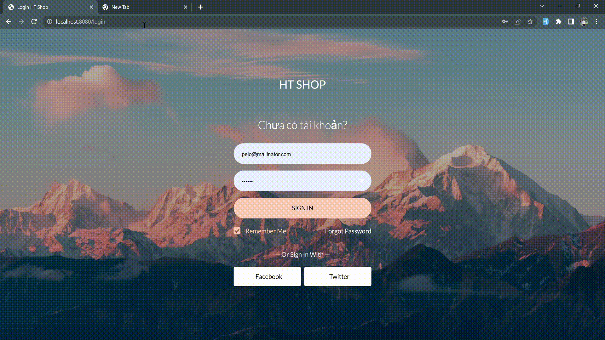
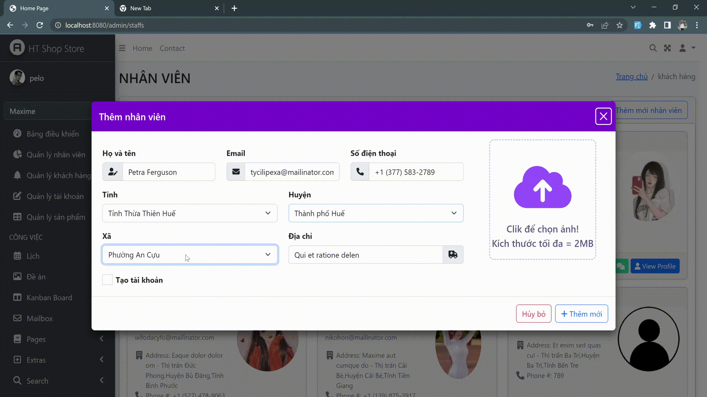

# ELECTRONIC STORE

## Introduction

This is an online sales management
system, including the Admin's management page that
allows to perform product management operations,
employees, customers (create, edit, delete) of the store,
customer page to view products. 💖

## Technology
Project is created with: 

## Demo project

   
  <i>Login </i>

   
  <i>Create Staff</i>

   
  <i>Edit, delete Staff</i>

   
  <i>Customers, Products</i>

   
  <i>Users Page</i>

